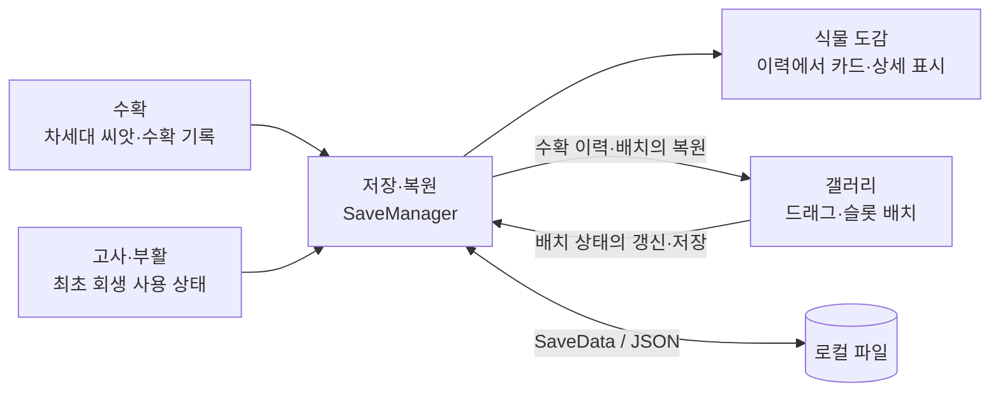

[日本語](README.md) | [한국어](README.ko.md)

# 窓辺の庭 | Unity 구현 포트폴리오

**키운 식물을 수확하고, 도감에 기록해서 갤러리에 전시합니다. 이 일련의 경험을 UI·게임 상태·저장 처리로 연결하는 구현을 담당했습니다.**

## 직접 플레이하기

**[iOS 체험판 플레이(TestFlight)](https://testflight.apple.com/join/NbdUbUZE)**

지원되는 iOS 단말과 TestFlight 앱이 필요합니다. 참가 조건과 빌드 유효 기간은 링크 페이지와 TestFlight 앱에서 확인해 주세요. 배포 빌드와 게시된 소스의 버전은 다를 수 있습니다.

| 작품 | 팀·담당자 | 개발 환경 |
| --- | --- | --- |
| 식물 육성 게임 『窓辺の庭』 창가의 정원 / WindowGarden iOS / Android 대상 | Team.Garden·3인 팀 ユ・ギヒョン / 62String | Unity 6000.3.11f1 / C# uGUI·TextMeshPro Input System·Coroutine·JSON |

## 담당 기능의 연결 관계

> 기능 간 데이터 연계를 나타낸 개요도입니다. 클래스 간의 정확한 호출 순서는 상세 자료에 기재했습니다.

## 담당 범위와 코드

**수확·고사/부활·식물 도감·갤러리·저장/복원의 기능 설계와 초기 구현을 주담당으로 진행했고, 이후의 기능 확장·결함 수정도 담당했습니다.** 게시된 버전에는 이 구현을 기반으로 팀 멤버가 나중에 추가한 기능 연계와 개선도 포함되어 있습니다.

| 기능 | 구현 포인트 | 소스 |
| --- | --- | --- |
| **수확** | 수확 조건, 차세대 씨앗 지급, 이력 등록, 월드 공간에서 UI로 이동하는 연출 | [Controller](Scripts/Harvest/HarvestController.cs) / [Popup](Scripts/Harvest/HarvestPopupUI.cs) |
| **고사·부활** | 이벤트 구독, 최초 회생, 아이템·보유 금액에 따른 부활 분기 | [DeathController](Scripts/DeathRevive/DeathController.cs) |
| **식물 도감** | 수확 이력을 통한 추출, 페이지 생성, 최신 기록을 사용한 상세 표시 | [Collection](Scripts/Encyclopedia/CollectionUI.cs) / [Card](Scripts/Encyclopedia/PlantCardUI.cs) / [Detail](Scripts/Encyclopedia/DetailPanelUI.cs) |
| **갤러리(식물 전시)** | 자유 배치에서 고정 슬롯으로의 사양 변경, 배치의 저장·복원, 드래그와 스크롤의 분리, 씬 전환 | [Placement](Scripts/Gallery/GalleryPlacementController.cs) / [Drag](Scripts/Gallery/GalleryPlantDragItem.cs) / [Transition](Scripts/Gallery/GalleryTransitionController.cs) / [Shader](Shaders/DirectionalUIFade.shader) |
| **저장·복원** | 각 기능의 상태 집약, JSON 저장, 데모/릴리스의 저장 위치 분리 | [Manager](Scripts/SaveLoad/SaveManager.cs) / [Data](Scripts/SaveLoad/SaveData.cs) |

## 설계·개선 읽어보기

**[구현 해설: 처리 흐름·분기·데이터 구조 (일본어)](docs/Implementation_ja.md)**

| 확인하고 싶은 내용 | 상세 자료 |
| --- | --- |
| 수확 확정 후 무엇을 어떤 순서로 처리하는가 | [수확 시퀀스 (일본어)](docs/Implementation_ja.md#harvest) |
| 회생·아이템 사용·구매를 어떻게 분기하는가 | [고사·부활 플로우 (일본어)](docs/Implementation_ja.md#revive) |
| 식물의 정의와 플레이 이력을 어떻게 조합하는가 | [도감의 데이터 플로우 (일본어)](docs/Implementation_ja.md#encyclopedia) |
| 자유 배치에서 고정 슬롯으로의 사양 변경에 어떻게 대응했는가 | [갤러리의 배치·조작·전환 (일본어)](docs/Implementation_ja.md#gallery) |
| 저장·복원의 책무와 현재의 제약은 무엇인가 | [저장·복원 (일본어)](docs/Implementation_ja.md#save-load) |
| 결함이나 테스트 환경의 혼재를 어떻게 개선했는가 | [개선 사례와 검증 범위 (일본어)](docs/Implementation_ja.md#improvements) |

## 게시 범위

- **제품 코드 18개 파일(C# 스크립트 17개·셰이더 1개)의 발췌**입니다. 공통 매니저·씬·Prefab·이미지는 포함되지 않으므로, 단독으로는 컴파일·실행할 수 없습니다.
- [초기 구현·기능 확장의 이력과 팀의 후속 수정 (일본어)](docs/Implementation_ja.md#contributions)을 구분해서 기재했습니다.
- 게시 기준은 원본 프로젝트의 커밋 `a8bde20`입니다. 저장 안정화의 추가 구현은 아직 포함하지 않았습니다.
- 재사용을 허가하는 라이선스는 설정하지 않았습니다.

## 개발 기간

**2026년 6월 17일~2026년 9월 8일(본인의 커밋 기록에 기반한 기간)**

원본 프로젝트의 `yoogihyun` / `62String` 명의의 커밋 이력을 기준으로 했습니다. 작품 전체의 개발 종료일을 나타내는 것은 아닙니다.
