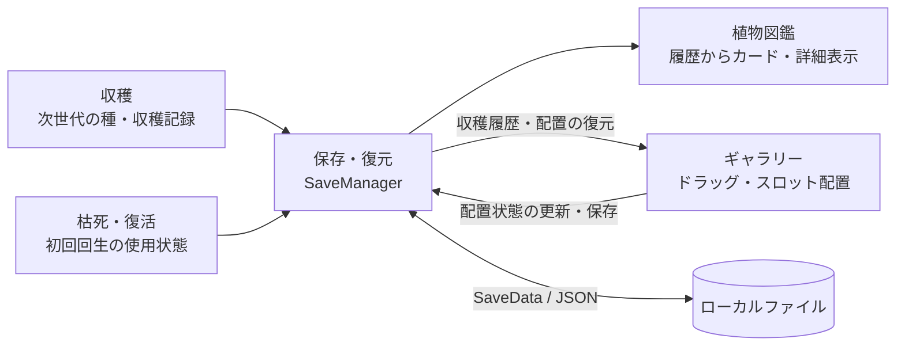

# 窓辺の庭 | Unity実装ポートフォリオ

**育てた植物を収穫し、図鑑に記録して、ギャラリーに飾る。その一連の体験をUI・ゲーム状態・保存処理につなぐ実装を担当しました。**

## 実際にプレイする

**[iOS体験版をプレイ（TestFlight）](https://testflight.apple.com/join/NbdUbUZE)**

対応するiOS端末とTestFlightアプリが必要です。参加条件とビルドの有効期限はリンク先・TestFlightアプリでご確認ください。配布ビルドと掲載ソースのバージョンは異なる場合があります。

| 作品 | チーム・担当者 | 開発環境 |
| --- | --- | --- |
| 植物育成ゲーム『窓辺の庭』 창가의 정원 / WindowGarden iOS / Android向け | Team.Garden・3人チーム ユ・ギヒョン / 62String | Unity 6000.3.11f1 / C# uGUI・TextMeshPro Input System・Coroutine・JSON |

## 担当機能のつながり

> 機能間のデータ連携を示した概要図です。クラス間の正確な呼び出し順は詳細資料に記載しています。

## 担当範囲とコード

**収穫・枯死／復活・植物図鑑・ギャラリー・保存／復元の機能設計と初期実装を主担当として行い、その後の機能拡張・不具合修正も担当しました。** 掲載版には、これらの実装を基にチームメンバーが後から追加した機能連携や改善も含まれます。

| 機能 | 実装のポイント | ソース |
| --- | --- | --- |
| **収穫** | 収穫条件、次世代の種付与、履歴登録、ワールド空間からUIへ移動する演出 | [Controller](Scripts/Harvest/HarvestController.cs) / [Popup](Scripts/Harvest/HarvestPopupUI.cs) |
| **枯死・復活** | イベント購読、初回回生、アイテム・所持金による復活分岐 | [DeathController](Scripts/DeathRevive/DeathController.cs) |
| **植物図鑑** | 収穫履歴による抽出、ページ生成、最新記録を使った詳細表示 | [Collection](Scripts/Encyclopedia/CollectionUI.cs) / [Card](Scripts/Encyclopedia/PlantCardUI.cs) / [Detail](Scripts/Encyclopedia/DetailPanelUI.cs) |
| **ギャラリー（植物を飾る）** | 自由配置から固定スロットへの仕様変更、配置の保存・復元、ドラッグとスクロールの分離、シーン遷移 | [Placement](Scripts/Gallery/GalleryPlacementController.cs) / [Drag](Scripts/Gallery/GalleryPlantDragItem.cs) / [Transition](Scripts/Gallery/GalleryTransitionController.cs) / [Shader](Shaders/DirectionalUIFade.shader) |
| **保存・復元** | 各機能の状態集約、JSON保存、デモ／リリースの保存先分離 | [Manager](Scripts/SaveLoad/SaveManager.cs) / [Data](Scripts/SaveLoad/SaveData.cs) |

## 設計・改善を読む

**[実装解説：処理フロー・分岐・データ構造](docs/Implementation_ja.md)**

| 確認したい内容 | 詳細資料 |
| --- | --- |
| 収穫確定後、何をどの順番で処理するか | [収穫シーケンス](docs/Implementation_ja.md#harvest) |
| 回生・アイテム使用・購入をどう分岐するか | [枯死・復活フロー](docs/Implementation_ja.md#revive) |
| 植物の定義とプレイ履歴をどう組み合わせるか | [図鑑のデータフロー](docs/Implementation_ja.md#encyclopedia) |
| 自由配置から固定スロットへの仕様変更にどう対応したか | [ギャラリーの配置・操作・遷移](docs/Implementation_ja.md#gallery) |
| 保存・復元の責務と現在の制約は何か | [保存・復元](docs/Implementation_ja.md#save-load) |
| 不具合やテスト環境の混在をどう改善したか | [改善事例と検証範囲](docs/Implementation_ja.md#improvements) |

## 掲載範囲

- **製品コード18ファイル（C#スクリプト17・シェーダー1）の抜粋**です。共通マネージャー・シーン・Prefab・画像は含まないため、単体ではコンパイル・実行できません。
- [初期実装・機能拡張の履歴とチームの後続修正](docs/Implementation_ja.md#contributions)を区別して記載しています。
- 掲載基準は元プロジェクトのコミット `a8bde20`。保存安定化の追加実装はまだ含めていません。
- 再利用を許諾するライセンスは設定していません。

## 開発期間

**2026年6月17日～2026年9月8日（本人のコミット記録に基づく期間）**

元プロジェクトの `yoogihyun` / `62String` 名義のコミット履歴を基準としています。作品全体の開発終了日を示すものではありません。
