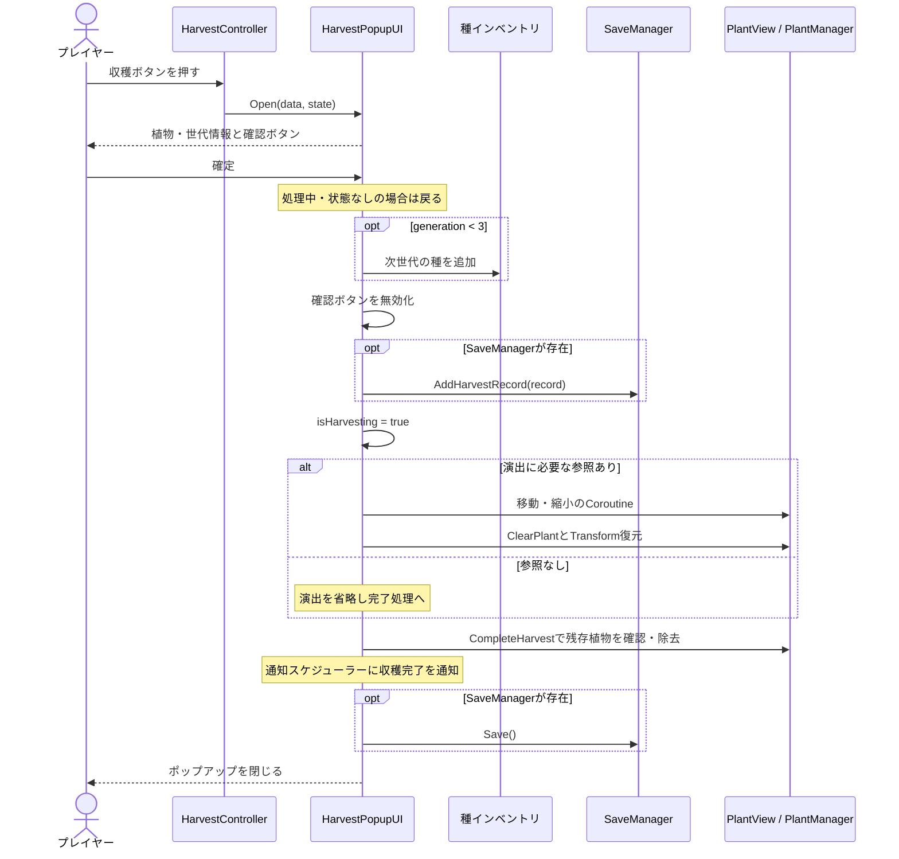
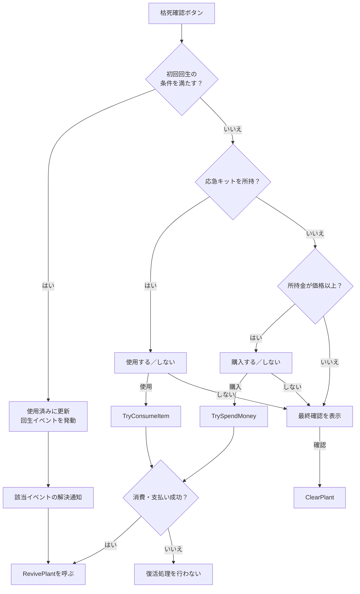
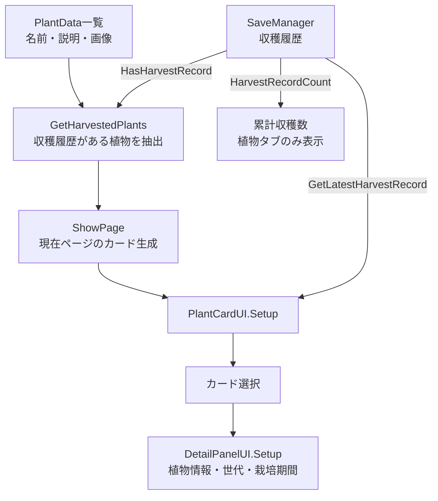
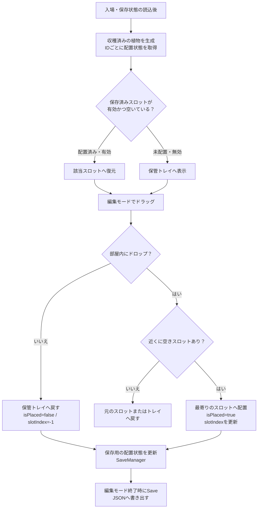
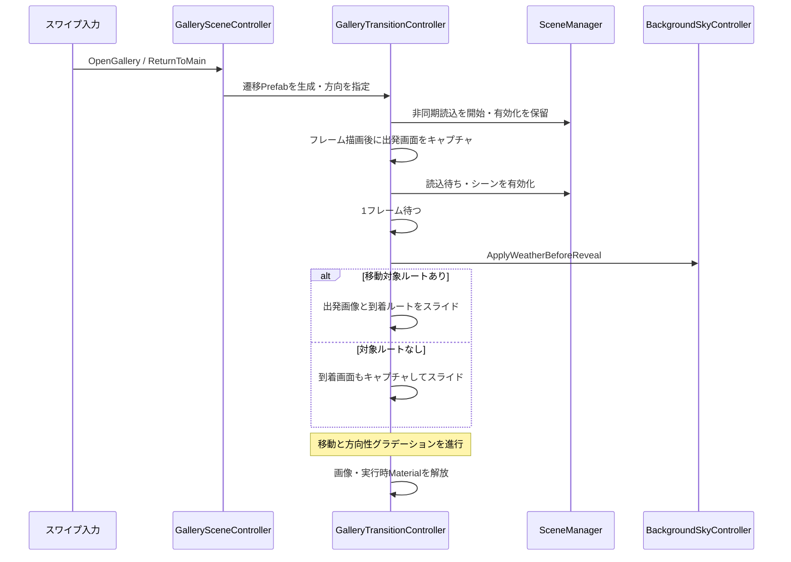
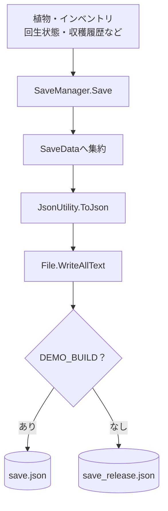
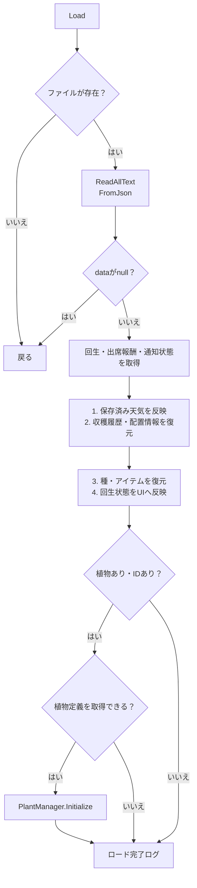

# 窓辺の庭 | 担当機能の実装解説

[READMEへ戻る](../README.md)

収穫・枯死／復活・植物図鑑・ギャラリー・保存処理について、掲載コードから読み取れる処理順と条件を整理した資料です。ゲーム全体の仕様書ではなく、担当機能を理解するための技術資料として構成しています。

| 対象 | 基準 |
| --- | --- |
| 対象コード | 担当機能に関連する18ファイル（C#スクリプト17・シェーダー1） |
| 想定読者 | 採用担当者・Unityエンジニア |
| 記載方針 | 実装済みの挙動と改善候補を区別。Inspectorの設定が不明な値はコード上の初期値として記載 |

**目次：** [収穫](#harvest) / [枯死・復活](#revive) / [図鑑](#encyclopedia) / [ギャラリー](#gallery) / [保存・復元](#save-load) / [改善事例](#improvements) / [担当範囲](#contributions)

<a id="harvest"></a>
## 1. 収穫：確定操作から保存まで

**目的：** 育成結果を次の種と収穫履歴へつなぎ、植物が図鑑へ移動する演出で完了を伝える。

コード：[HarvestController.cs](../Scripts/Harvest/HarvestController.cs) / [HarvestPopupUI.cs](../Scripts/Harvest/HarvestPopupUI.cs)

### 処理シーケンス



### 条件と責務

| 項目 | 掲載コードの挙動 | 対応メソッド |
| --- | --- | --- |
| ボタン表示 | 植物状態があり、`harvestReady` が真で、収穫ポップアップが閉じている | `UpdateHarvestButton()` |
| 確定操作のガード | 処理中または状態なしなら戻る。確認ボタンも無効化する | `OnConfirm()` |
| 次世代の種 | 世代が3未満の場合のみ、`generation + 1` の種を追加 | `OnConfirm()` |
| 収穫履歴 | 植物ID、世代、植え付け・収穫時刻を記録 | `AddHarvestRecord()` |
| 演出 | 補間係数 `t * t * (3 - 2 * t)` で移動・縮小 | `PlayHarvestAnimation()` |
| 演出省略 | PlantView、目的地、カメラのいずれかがなければ完了処理へ | 同上 |

**座標変換の要点：** 図鑑ボタンの位置をスクリーン座標へ変換し、植物の奥行きを使ってワールド座標へ戻します。異なる描画空間のオブジェクトを、画面上で同じ目的地に向かわせるためです。

> 種の付与と収穫記録の追加は演出前、ファイル保存は演出後です。この一連の処理にトランザクションやロールバックはありません。途中例外・演出中断まで含めて完全な一回実行を保証する実装ではありません。

<a id="revive"></a>
## 2. 枯死・復活：状況に応じた選択肢

**目的：** 枯死した植物に対して、初回回生・応急キット・購入という選択肢を状態に応じて提示する。

コード：[DeathController.cs](../Scripts/DeathRevive/DeathController.cs)

### 確認ボタン押下後の分岐



| 処理 | 実装内容 |
| --- | --- |
| 初回回生の条件 | 未使用であり、回生イベントと `EventManager` が存在すること |
| イベント購読 | `Start()` で枯死・イベント解決通知を購読し、`OnDestroy()` で解除 |
| 警告表示 | 活力30以下で警告バッジ。生存中は赤み、枯死状態では暗い色を適用 |
| 操作制限 | 植物状態が存在し、枯死している場合にクリック遮断オブジェクトを有効化 |
| キット価格 | アイテム定義の価格を優先。なければ初期値100のフォールバック。負数は0へ補正 |
| 復活時の値 | `reviveVitality` を渡す。コード上の初期値は40で、Inspectorから変更可能 |
| 初回回生の保存 | `GetFirstReviveUsedForSave()` / `SetFirstReviveUsedFromSave()` で受け渡し |

**実装上の注意：** 初回使用フラグはイベント発動前に更新します。この分岐内では直接保存を呼びません。また `HandleDeath()` は `statusPopup` がないと戻るため、UI参照の設定が必要です。イベント解決時はイベントの一致を判定し、選択番号ごとの分岐は行っていません。

<a id="encyclopedia"></a>
## 3. 植物図鑑：定義データと収穫履歴を合成

**目的：** 収穫済みの植物を一覧化し、直近の育成結果を詳細画面で振り返れるようにする。

コード：[CollectionUI.cs](../Scripts/Encyclopedia/CollectionUI.cs) / [PlantCardUI.cs](../Scripts/Encyclopedia/PlantCardUI.cs) / [DetailPanelUI.cs](../Scripts/Encyclopedia/DetailPanelUI.cs)



### 表示ルール

| 項目 | ルール |
| --- | --- |
| 植物定義の取得元 | `GameManager.availablePlants` があれば優先し、なければInspectorの `plantDataList` |
| 表示対象 | 有効な植物IDを持ち、収穫履歴が存在する植物定義 |
| ページ生成 | 既存カードを破棄し、現在ページのカードを生成。`cardsPerPage` の初期値は9 |
| ページ境界 | 0件でもページ数を1以上にし、前後ボタンを範囲に応じて無効化 |
| 詳細に使う履歴 | リストを末尾から検索した、植物IDが一致する最新の追加記録 |
| 栽培期間 | 保存されたUTC ticksをローカル時刻へ変換して表示。時刻が未設定なら `-` |
| 累計収穫数 | 植物の種類数ではなく、収穫記録の総件数 |

**設計上の分離：** 名前や画像は植物定義、世代や収穫時刻はプレイ履歴に持たせています。カードと詳細画面は両者を組み合わせて表示する役割です。現在のページ更新は再生成方式であり、オブジェクトプールは導入していません。

<a id="gallery"></a>
## 4. ギャラリー：収穫した植物を飾る

**目的：** 収穫済みの植物を保管トレイから取り出して棚へ配置し、再入場後も飾った状態を維持する。

### コードの役割

| コード | 責務 |
| --- | --- |
| [GalleryPlacementController.cs](../Scripts/Gallery/GalleryPlacementController.cs) | 収穫済み植物の生成、空きスロット探索、配置・復元、保存用状態の更新 |
| [GalleryPlantDragItem.cs](../Scripts/Gallery/GalleryPlantDragItem.cs) | ドラッグ方向の判定、スクロールへの受け渡し、表示倍率・基準位置の切り替え |
| [GalleryPlacementSlot.cs](../Scripts/Gallery/GalleryPlacementSlot.cs) | スロット番号と配置ガイドの表示 |
| [GalleryEditModeController.cs](../Scripts/Gallery/GalleryEditModeController.cs) | 編集モード、保管トレイ、シーンスワイプの切り替え、編集終了時の保存 |
| [GallerySwipeController.cs](../Scripts/Gallery/GallerySwipeController.cs) | Input Systemによる横スワイプ判定とシーン移動要求 |
| [UIInputBlocker.cs](../Scripts/Gallery/UIInputBlocker.cs) | 表示中のUIに応じてシーンスワイプを抑止 |
| [GallerySceneController.cs](../Scripts/Gallery/GallerySceneController.cs) | 移動先・方向の指定、遷移の多重開始防止 |
| [GalleryTransitionController.cs](../Scripts/Gallery/GalleryTransitionController.cs) | 非同期シーン読込、画面キャプチャ、スライドとフェードの進行 |
| [GalleryTransitionTarget.cs](../Scripts/Gallery/GalleryTransitionTarget.cs) | 遷移演出で移動する画面ルートの指定 |
| [DirectionalUIFade.shader](../Shaders/DirectionalUIFade.shader) | 方向と進行度に応じた黒いグラデーションのアルファ計算 |

### 現在の配置フロー



生成対象は収穫回数分ではなく、`HasHarvestRecord(plantId)` を満たす植物定義です。表示画像には最後の有効な成長段階のスプライトを使います。`Start()` では1フレーム待ってからスロットを構成し、植物を生成します。

スロット番号は `placementSlotsRoot` の子順から割り当てます。ドロップ位置を部屋のローカル座標へ変換し、`slotSnapDistance` 内で最も近い空きスロットを選びます。配置先の子に付け替え、中央アンカー・`anchoredPosition = Vector2.zero` に合わせるため、現在の方式は自由座標配置ではありません。

> `SetGalleryPlantState()` はメモリ上の状態更新です。ドロップのたびにファイルを書き込むのではなく、編集モード終了時などの `Save()` で永続化します。

### 自由配置から固定スロットへの変更

| 段階・根拠 | 本人が実装した内容 |
| --- | --- |
| 7月23日 `6267616` / `f8336c7` | 配置保存モデルと取得・更新API、スワイプ・配置・ドラッグの骨格を追加 |
| 7月25日 `0ba0fdd` | 部屋内のドロップ位置を `Mathf.InverseLerp` で0〜1へ正規化し、`normalizedX/Y` を保存。再入場時はアンカー座標へ戻す自由配置を実装 |
| 8月5日 `8976c5f` | 固定スロットへ変更。`slotIndex` を追加し、空き判定・スナップ・配置ガイド・無効ドロップ時の復帰・保存復元を実装 |
| 8月6日 `914fc9a` | トレイの横スクロールと上方向の取り出しを分離。シーン側にViewportのマスクとContent Size Fitterを設定 |
| 8月28日 `8f8172c` | 成長段階別の正規化倍率をギャラリーへ適用し、トレイと配置状態の倍率を分離 |
| 9月5日 `311811e` / 9月6日 `f757bd1` | Native Sizeと鉢の下端基準で表示を補正。ギャラリー専用倍率を植物定義に追加 |

**仕様変更前の自由配置と、変更後のスロット配置の両方を本人が担当しています。** コミットには方式変更が明記されていますが、その判断に至った企画上の理由までは推測して記載しません。

旧フィールドの `normalizedX/Y`、`listOrder`、`sortingOrder` は保存モデルに残っています。ただし現在の位置復元は `slotIndex` を使用し、保存順によるカードの並べ替えや前後関係の復元は行っていません。旧座標をスロットへ自動変換する移行処理もなく、無効なスロット情報は未配置へ戻します。スロットの子順を変えると番号の意味も変わる点が、現在の保存方式の制約です。

### タッチ操作と見た目の分離

| 操作・状態 | 掲載コードの挙動 |
| --- | --- |
| トレイ上で左右にドラッグ | Content幅がViewport幅を超える場合のみScrollRectへ転送。カード枚数を固定値で判定しない |
| トレイ上で上方向にドラッグ | 植物配置モードへ切り替え、スクロールの慣性を停止 |
| トレイ上で下方向にドラッグ | 植物の取り出しを開始しない |
| 配置済みの植物をドラッグ | 編集中は方向にかかわらず植物を移動 |
| 編集中 | シーン切替用スワイプを無効化し、空きスロットのガイドを表示 |
| トレイ内の画像 | 中央ピボットでカード内に配置 |
| 棚へ置いた画像 | 下端中央ピボットとYオフセットで鉢の接地位置を調整 |

表示倍率は `galleryBaseScale × 植物別倍率 × 配置状態別倍率` です。植物別倍率には `PlantData.galleryVisualScaleOverride` が正ならそれを使い、未指定なら `GetGrowthStageVisualScale()` を使います。元の正規化倍率の基盤はチームメンバーが実装し、本人がギャラリーへの適用と専用補正を担当しました。

### シーン遷移と担当の境界



本人は `723c953` で遷移制御を新規作成し、`1531e50`・`5f175f8` で演出を改修しました。`5f175f8` では方向性フェード用シェーダーも追加し、画面キャプチャと表示タイミングを調整しています。

掲載版にはその後のチーム改善も含みます。`adeb875` ではキャプチャキャッシュの利用、出発・到着それぞれのフェード、移動タイミングとシェーダーが拡張されました。`5b5191a` ではキャッシュ経路を削除し、現在の出発画面を撮り直して、到着画面の公開前に天気を反映する流れへ変更されています。**上図は本人の初期版だけでなく、チーム改善後の掲載版のフローです。**

<a id="save-load"></a>
## 5. 保存・復元：複数機能の状態を集約

コード：[SaveManager.cs](../Scripts/SaveLoad/SaveManager.cs) / [SaveData.cs](../Scripts/SaveLoad/SaveData.cs)

### 保存先の選択と書き込み



上図の分岐は保存先の対応を示します。実装ではビルド時の `#if DEMO_BUILD` によってファイル名が確定し、実行時にファイル名を選び直すわけではありません。

### ロード順序



これは**掲載版の実際の順序**です。読み込み・JSON解析時の例外を捕捉する処理はなく、例外発生時はこの正常系フローを完了しません。植物定義が取得できない場合も、掲載版ではエラー扱いせず完了ログに進みます。

### 保存データの責務

| データ | 主なフィールド | 用途 |
| --- | --- | --- |
| 現在の植物 | `hasPlant`, `plantId`, `PlantState` | 育成中の状態を復元 |
| 所持品 | `seeds`, `items` | 種・アイテムの所持状態 |
| 回生状態 | `firstReviveUsed` | 初回回生の使用有無 |
| 収穫記録 | `harvestRecords` | 図鑑の開放・件数・詳細表示 |
| 配置情報 | `galleryPlants` | 植物ID・配置状態・`slotIndex`。表示と復元は[ギャラリー](#gallery)参照 |
| 時刻 | `lastSavedUtcTicks` | 保存時点を記録 |
| その他の連携 | `weatherState`, 出席報酬フィールド, `notificationState` | チームの関連機能の状態保存 |

`HarvestRecordData` は植物ID・世代・植え付け時刻・収穫時刻を保持します。`traitIds` も残っていますが、現在掲載している収穫確定処理では特性の選択・設定を行いません。

### 現在の制約と改善方向

| 掲載版の挙動 | リスク・改善方向 |
| --- | --- |
| 原本へ直接書き込み | 書き込み中断への備えとして、検証済み一時ファイルによる置換・バックアップが必要 |
| ロード成功状態を管理していない | ロード失敗後に初期状態を自動保存してしまう経路を防ぐ必要 |
| 天気通知が他の状態復元より先 | イベント購読側が部分復元中の状態へアクセスする可能性を考慮する必要 |
| ファイル名のみデモ／リリース分離 | PlayerPrefs、OS権限、ウィジェット共有領域はこの分離の対象外 |

> `SaveFileStore`・`SaveSafetyChecks` による安定化は別途作業中で、掲載版には含みません。特定ユーザーのデータ消失について、これらのリスクが実際の発生原因だったと断定するものではありません。

<a id="improvements"></a>
## 6. 改善事例と検証範囲

### 事例A：2回目の収穫で確認ボタンが押せない

| 観点 | 内容 |
| --- | --- |
| 症状 | 収穫後、次の収穫ポップアップで確認ボタンが無効のままになる |
| 原因 | 確定時に無効化した状態を、再表示時に戻していなかった |
| 変更 | `Open()` で `confirmButton.interactable = true` を設定 |
| 着眼点 | 閉じる処理だけでなく、再表示時にUI状態を初期化する |
| 根拠 | 元プロジェクトのコミット `cff9aad` と掲載コード。今回の資料作成では実機再テストは未実施 |

**変更箇所の抜粋（前 → 後）：**

```csharp
// Before: Open()で状態を受け取るだけ
currentState = state;

// After: 再表示時にボタンも操作可能へ戻す
currentState = state;
confirmButton.interactable = true;
```

当時のコミットには特性選択値のリセットも含まれます。上記は、現在の掲載版にも残る確認ボタンの変更だけを抜粋しています。

### 事例B：デモとリリースの保存先を分離

| 観点 | 変更前 | 変更後 |
| --- | --- | --- |
| 保存先 | 同じ `save.json` | `DEMO_BUILD` なら `save.json`、それ以外は `save_release.json` |
| テストデータ | 同一保存領域では混在し得る | ファイル名によって進行データを分離 |
| 既存データ | 共通ファイルを使用 | 自動移行・削除はしない |

```csharp
#if DEMO_BUILD
private const string SaveFileName = "save.json";
#else
private const string SaveFileName = "save_release.json";
#endif
```

根拠：元プロジェクトのコミット `a8bde20`。初期配布データの変更も含まれるコミットですが、この資料では保存側の変更を対象とします。

### この資料で確認したこと

| 項目 | 確認状況 |
| --- | --- |
| 処理順・条件 | 掲載18ファイル（C#17・シェーダー1）を読んでフローと照合 |
| 本人・チームの担当区分 | 元プロジェクトのコミット履歴とdiffを確認 |
| コードの同一性 | 同一コミットから抜粋。`DeathController.cs` は末尾改行のみ追加 |
| 単体コンパイル・実機動作 | この抜粋レポでは未実施。共通コードとシーンを同梱していないため単体実行不可 |
| 保存安定化の検証結果 | 掲載版の結果には含めない |

<a id="contributions"></a>
## 7. 初期実装と機能拡張の担当範囲

**本資料で扱う収穫・枯死／復活・植物図鑑・ギャラリー・保存／復元は、本人が主担当として機能設計・初期実装を行い、その後も拡張してきた機能です。** 既存機能の一部修正だけを担当したものではありません。チームメンバーによる後続の機能連携・改善は、以下で分けて記載します。

### 本人による初期実装の根拠

元プロジェクトのファイル追加diffと、移動前のパスを含む変更履歴を確認しています。担当者のコミット名は `yoogihyun` / `62String` です。

| ファイル | 初期実装のコミット | その時点で実装した内容 |
| --- | --- | --- |
| `CollectionUI.cs` | `4043623` | ページ表示・前後移動・ボタン接続。初期パスは `Assets/Scripts/UI/CollectionUI.cs` で、後に配置先を変更 |
| `SaveManager.cs` | `817aa89` | 新規作成時から `Save()`・`Load()`・`ResetSave()` を実装。植物・種・アイテムのJSON保存と復元 |
| `SaveData.cs` | `817aa89` | 植物状態、種、アイテム、保存時刻をまとめるシリアライズ用モデルを新規作成 |
| `HarvestPopupUI.cs` | `a363d54` | 植物情報を表示する収穫ポップアップ、当時の特性選択処理を新規実装 |
| `DeathController.cs` | `03c5656` | 枯死イベントと表示制御を接続するコントローラーを新規実装 |
| `GalleryPlacementController.cs`, `GalleryPlantDragItem.cs`, `GallerySwipeController.cs` | `f8336c7` | 配置・ドラッグ・スワイプの骨格を新規作成。`0ba0fdd` でGalleryフォルダーへ移動し、自由配置・保存・シーン連携を実装 |
| `GalleryEditModeController.cs`, `GallerySceneController.cs`, `UIInputBlocker.cs` | `0ba0fdd` | 編集モード、シーン移動、UI状態に応じたスワイプ抑止を新規実装 |
| `GalleryPlacementSlot.cs` | `8976c5f` | 固定スロットの番号とガイドを新規実装 |
| `GalleryTransitionController.cs`, `GalleryTransitionTarget.cs` | `723c953` | シーン遷移演出の制御と移動対象ルートを新規実装 |
| `DirectionalUIFade.shader` | `5f175f8` | 方向性フェード用シェーダーを新規実装 |

### 本人による主な機能拡張

| 分類 | 拡張・改善した内容 | 主なコミット |
| --- | --- | --- |
| 収穫 | 次世代の種付与から空の鉢への遷移、収穫記録、図鑑への移動演出 | `70d4428` / `bf32fff` / `86f500e` |
| 枯死・復活 | 応急キット・購入による復活分岐、初回回生イベントと保存連携 | `b35691e` / `5a2a634` |
| 植物図鑑 | タブ・ページ境界、動的カード生成、詳細表示、収穫履歴による抽出・件数表示 | `4cf791b` / `0456e49` / `c0bc927` / `7554944` / `4727b49` |
| ギャラリー配置 | 自由配置から固定スロットへ変更、ドラッグとスクロールの分離、表示倍率・下端位置の調整 | `0ba0fdd` / `8976c5f` / `914fc9a` / `8f8172c` / `311811e` / `f757bd1` |
| ギャラリー遷移 | スライド・方向性フェード、キャプチャと表示タイミングの調整 | `723c953` / `1531e50` / `5f175f8` |
| 保存・復元 | 回生・収穫・配置情報の保存、実行中データの初期化、デモ／リリース分離 | `5a2a634` / `bf32fff` / `6267616` / `0fe7dca` / `a8bde20` |

### チームメンバーによる後続の追加・改善

本人の初期実装・拡張を基に、チーム開発の過程で以下の変更が加わっています。掲載版では機能間のつながりを保つため、その変更も残しています。

| ファイル | 後続の追加・改善 |
| --- | --- |
| `HarvestPopupUI.cs` | 世代処理の一部、演出中の植物位置合わせ制御 |
| `CollectionUI.cs` | 種一覧の接続、道具タブ、ポップアップ演出、タブ表示調整 |
| `SaveManager.cs` | 出席報酬・天気の保存連携、インベントリ取得・シーン間維持処理の一部 |
| `SaveData.cs` | 出席報酬・天気の保存フィールド |
| `GallerySceneController.cs`, `GalleryTransitionController.cs` | `adeb875` のキャッシュ・フェード・移動タイミング拡張、`5b5191a` のキャッシュ削除と天気反映後の表示処理 |
| `DirectionalUIFade.shader` | `adeb875` のエフェクトモード・グラデーション計算の拡張 |
| `PlantData`（依存コード・未掲載） | `34a3f26` の成長段階別正規化倍率。本人は後にギャラリー適用と専用倍率を追加 |

上記は担当機能の実装履歴を示すものであり、依存するゲーム基盤や素材を含めた作品全体の単独制作を意味するものではありません。

### 未掲載の依存要素

| 要素 | 掲載コードとの接点 |
| --- | --- |
| `GameManager`, `PlantManager` | 定義データ取得、植物状態、枯死通知、復活・除去 |
| 種・アイテムのインベントリ | 種の付与、所持判定、消費・支払い、保存リスト |
| `PlantData`, `PlantState`, `PlantView` | 植物の定義・状態・描画 |
| `BackgroundSkyController` | シーン遷移で到着画面を表示する前の天気反映 |
| イベント・通知システム | 初回回生イベント、収穫後の通知スケジュール連携 |
| シーン・Prefab・共通UI | Inspector参照、画面配置、ポップアップの表示制御 |

**掲載方針：** 第三者製アセット、製品の保存データ、署名・認証情報は収録していません。

### ソースの基準情報

掲載した18ファイル（C#スクリプト17・シェーダー1）は、元プロジェクトのコミット `a8bde20` を基準に抜粋しています。ギャラリー関連の追加10ファイルは同コミットとバイト単位で同一です。
