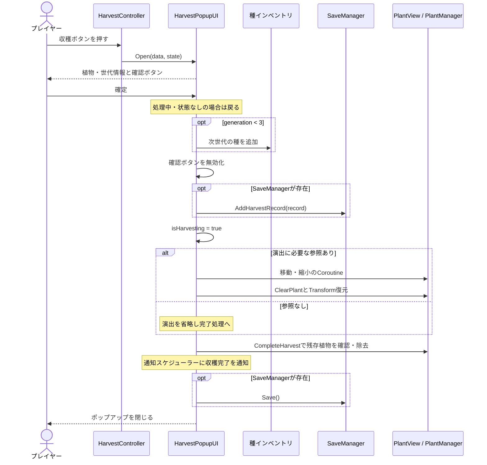
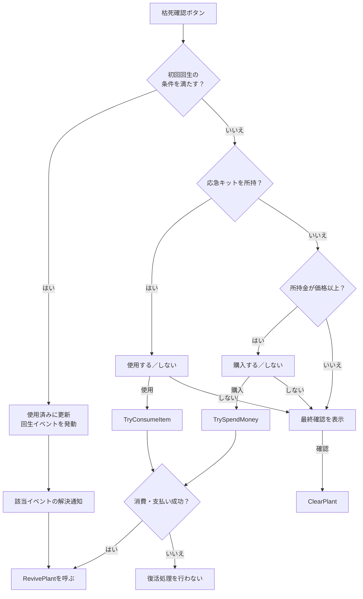
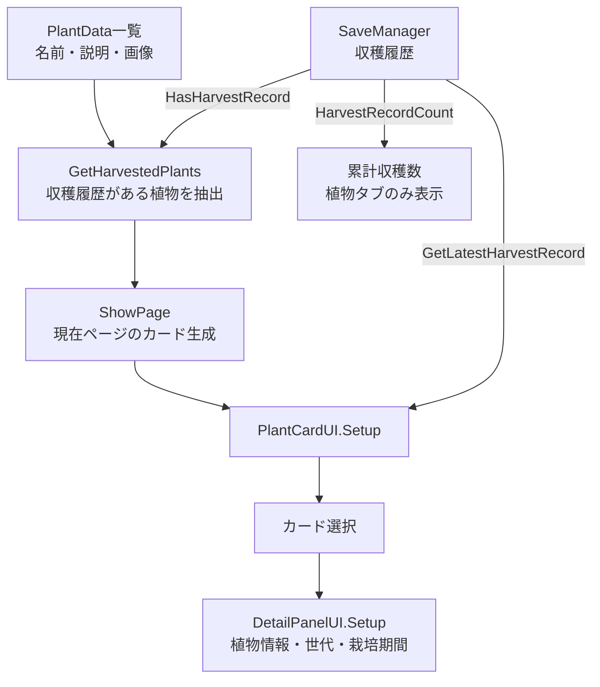
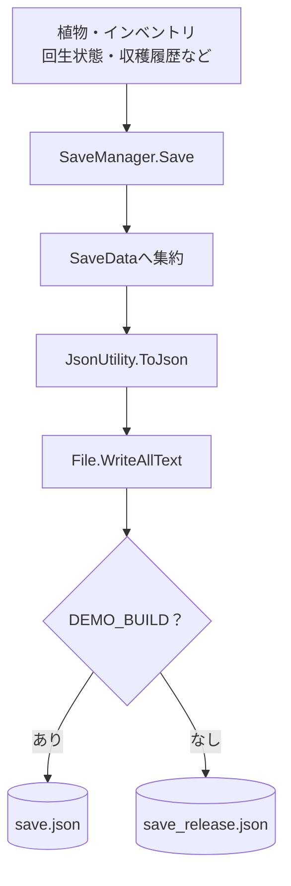
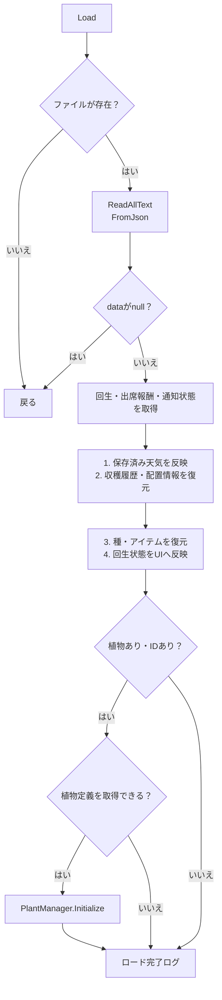

# 窓辺の庭 | 担当機能の実装解説

[READMEへ戻る](../README.md)

収穫・枯死／復活・植物図鑑・保存処理について、掲載コードから読み取れる処理順と条件を整理した資料です。ゲーム全体の仕様書ではなく、担当機能を理解するための技術資料として構成しています。

| 対象 | 基準 |
| --- | --- |
| 対象コード | 担当機能に関連するC#スクリプト8ファイル |
| 想定読者 | 採用担当者・Unityエンジニア |
| 記載方針 | 実装済みの挙動と改善候補を区別。Inspectorの設定が不明な値はコード上の初期値として記載 |

**目次：** [収穫](#harvest) / [枯死・復活](#revive) / [図鑑](#encyclopedia) / [保存・復元](#save-load) / [改善事例](#improvements) / [担当範囲](#contributions)

<a id="harvest"></a>
## 1. 収穫：確定操作から保存まで

**目的：** 育成結果を次の種と収穫履歴へつなぎ、植物が図鑑へ移動する演出で完了を伝える。

コード：[HarvestController.cs](../Scripts/Harvest/HarvestController.cs) / [HarvestPopupUI.cs](../Scripts/Harvest/HarvestPopupUI.cs)

### 処理シーケンス



### 条件と責務

| 項目 | 掲載コードの挙動 | 対応メソッド |
| --- | --- | --- |
| ボタン表示 | 植物状態があり、`harvestReady` が真で、収穫ポップアップが閉じている | `UpdateHarvestButton()` |
| 確定操作のガード | 処理中または状態なしなら戻る。確認ボタンも無効化する | `OnConfirm()` |
| 次世代の種 | 世代が3未満の場合のみ、`generation + 1` の種を追加 | `OnConfirm()` |
| 収穫履歴 | 植物ID、世代、植え付け・収穫時刻を記録 | `AddHarvestRecord()` |
| 演出 | 補間係数 `t * t * (3 - 2 * t)` で移動・縮小 | `PlayHarvestAnimation()` |
| 演出省略 | PlantView、目的地、カメラのいずれかがなければ完了処理へ | 同上 |

**座標変換の要点：** 図鑑ボタンの位置をスクリーン座標へ変換し、植物の奥行きを使ってワールド座標へ戻します。異なる描画空間のオブジェクトを、画面上で同じ目的地に向かわせるためです。

> 種の付与と収穫記録の追加は演出前、ファイル保存は演出後です。この一連の処理にトランザクションやロールバックはありません。途中例外・演出中断まで含めて完全な一回実行を保証する実装ではありません。

<a id="revive"></a>
## 2. 枯死・復活：状況に応じた選択肢

**目的：** 枯死した植物に対して、初回回生・応急キット・購入という選択肢を状態に応じて提示する。

コード：[DeathController.cs](../Scripts/DeathRevive/DeathController.cs)

### 確認ボタン押下後の分岐



| 処理 | 実装内容 |
| --- | --- |
| 初回回生の条件 | 未使用であり、回生イベントと `EventManager` が存在すること |
| イベント購読 | `Start()` で枯死・イベント解決通知を購読し、`OnDestroy()` で解除 |
| 警告表示 | 活力30以下で警告バッジ。生存中は赤み、枯死状態では暗い色を適用 |
| 操作制限 | 植物状態が存在し、枯死している場合にクリック遮断オブジェクトを有効化 |
| キット価格 | アイテム定義の価格を優先。なければ初期値100のフォールバック。負数は0へ補正 |
| 復活時の値 | `reviveVitality` を渡す。コード上の初期値は40で、Inspectorから変更可能 |
| 初回回生の保存 | `GetFirstReviveUsedForSave()` / `SetFirstReviveUsedFromSave()` で受け渡し |

**実装上の注意：** 初回使用フラグはイベント発動前に更新します。この分岐内では直接保存を呼びません。また `HandleDeath()` は `statusPopup` がないと戻るため、UI参照の設定が必要です。イベント解決時はイベントの一致を判定し、選択番号ごとの分岐は行っていません。

<a id="encyclopedia"></a>
## 3. 植物図鑑：定義データと収穫履歴を合成

**目的：** 収穫済みの植物を一覧化し、直近の育成結果を詳細画面で振り返れるようにする。

コード：[CollectionUI.cs](../Scripts/Encyclopedia/CollectionUI.cs) / [PlantCardUI.cs](../Scripts/Encyclopedia/PlantCardUI.cs) / [DetailPanelUI.cs](../Scripts/Encyclopedia/DetailPanelUI.cs)



### 表示ルール

| 項目 | ルール |
| --- | --- |
| 植物定義の取得元 | `GameManager.availablePlants` があれば優先し、なければInspectorの `plantDataList` |
| 表示対象 | 有効な植物IDを持ち、収穫履歴が存在する植物定義 |
| ページ生成 | 既存カードを破棄し、現在ページのカードを生成。`cardsPerPage` の初期値は9 |
| ページ境界 | 0件でもページ数を1以上にし、前後ボタンを範囲に応じて無効化 |
| 詳細に使う履歴 | リストを末尾から検索した、植物IDが一致する最新の追加記録 |
| 栽培期間 | 保存されたUTC ticksをローカル時刻へ変換して表示。時刻が未設定なら `-` |
| 累計収穫数 | 植物の種類数ではなく、収穫記録の総件数 |

**設計上の分離：** 名前や画像は植物定義、世代や収穫時刻はプレイ履歴に持たせています。カードと詳細画面は両者を組み合わせて表示する役割です。現在のページ更新は再生成方式であり、オブジェクトプールは導入していません。

<a id="save-load"></a>
## 4. 保存・復元：複数機能の状態を集約

コード：[SaveManager.cs](../Scripts/SaveLoad/SaveManager.cs) / [SaveData.cs](../Scripts/SaveLoad/SaveData.cs)

### 保存先の選択と書き込み



上図の分岐は保存先の対応を示します。実装ではビルド時の `#if DEMO_BUILD` によってファイル名が確定し、実行時にファイル名を選び直すわけではありません。

### ロード順序



これは**掲載版の実際の順序**です。読み込み・JSON解析時の例外を捕捉する処理はなく、例外発生時はこの正常系フローを完了しません。植物定義が取得できない場合も、掲載版ではエラー扱いせず完了ログに進みます。

### 保存データの責務

| データ | 主なフィールド | 用途 |
| --- | --- | --- |
| 現在の植物 | `hasPlant`, `plantId`, `PlantState` | 育成中の状態を復元 |
| 所持品 | `seeds`, `items` | 種・アイテムの所持状態 |
| 回生状態 | `firstReviveUsed` | 初回回生の使用有無 |
| 収穫記録 | `harvestRecords` | 図鑑の開放・件数・詳細表示 |
| 配置情報 | `galleryPlants` | ギャラリーの配置・順序。表示処理は今回未掲載 |
| 時刻 | `lastSavedUtcTicks` | 保存時点を記録 |
| その他の連携 | `weatherState`, 出席報酬フィールド, `notificationState` | チームの関連機能の状態保存 |

`HarvestRecordData` は植物ID・世代・植え付け時刻・収穫時刻を保持します。`traitIds` も残っていますが、現在掲載している収穫確定処理では特性の選択・設定を行いません。

### 現在の制約と改善方向

| 掲載版の挙動 | リスク・改善方向 |
| --- | --- |
| 原本へ直接書き込み | 書き込み中断への備えとして、検証済み一時ファイルによる置換・バックアップが必要 |
| ロード成功状態を管理していない | ロード失敗後に初期状態を自動保存してしまう経路を防ぐ必要 |
| 天気通知が他の状態復元より先 | イベント購読側が部分復元中の状態へアクセスする可能性を考慮する必要 |
| ファイル名のみデモ／リリース分離 | PlayerPrefs、OS権限、ウィジェット共有領域はこの分離の対象外 |

> `SaveFileStore`・`SaveSafetyChecks` による安定化は別途作業中で、掲載版には含みません。特定ユーザーのデータ消失について、これらのリスクが実際の発生原因だったと断定するものではありません。

<a id="improvements"></a>
## 5. 改善事例と検証範囲

### 事例A：2回目の収穫で確認ボタンが押せない

| 観点 | 内容 |
| --- | --- |
| 症状 | 収穫後、次の収穫ポップアップで確認ボタンが無効のままになる |
| 原因 | 確定時に無効化した状態を、再表示時に戻していなかった |
| 変更 | `Open()` で `confirmButton.interactable = true` を設定 |
| 着眼点 | 閉じる処理だけでなく、再表示時にUI状態を初期化する |
| 根拠 | 元プロジェクトのコミット `cff9aad` と掲載コード。今回の資料作成では実機再テストは未実施 |

**変更箇所の抜粋（前 → 後）：**

```csharp
// Before: Open()で状態を受け取るだけ
currentState = state;

// After: 再表示時にボタンも操作可能へ戻す
currentState = state;
confirmButton.interactable = true;
```

当時のコミットには特性選択値のリセットも含まれます。上記は、現在の掲載版にも残る確認ボタンの変更だけを抜粋しています。

### 事例B：デモとリリースの保存先を分離

| 観点 | 変更前 | 変更後 |
| --- | --- | --- |
| 保存先 | 同じ `save.json` | `DEMO_BUILD` なら `save.json`、それ以外は `save_release.json` |
| テストデータ | 同一保存領域では混在し得る | ファイル名によって進行データを分離 |
| 既存データ | 共通ファイルを使用 | 自動移行・削除はしない |

```csharp
#if DEMO_BUILD
private const string SaveFileName = "save.json";
#else
private const string SaveFileName = "save_release.json";
#endif
```

根拠：元プロジェクトのコミット `a8bde20`。初期配布データの変更も含まれるコミットですが、この資料では保存側の変更を対象とします。

### この資料で確認したこと

| 項目 | 確認状況 |
| --- | --- |
| 処理順・条件 | 掲載8ファイルを読んでフローと照合 |
| 本人・チームの担当区分 | 元プロジェクトのコミット履歴とdiffを確認 |
| コードの同一性 | 同一コミットから抜粋。`DeathController.cs` は末尾改行のみ追加 |
| 単体コンパイル・実機動作 | この抜粋レポでは未実施。共通コードとシーンを同梱していないため単体実行不可 |
| 保存安定化の検証結果 | 掲載版の結果には含めない |

<a id="contributions"></a>
## 6. 本人の担当と共同修正

| 分類 | 本人の主な担当 | チームメンバーの主な追加・修正 |
| --- | --- | --- |
| 収穫 | 収穫UI、次世代の種付与、履歴登録、移動演出 | 世代処理の一部、演出中の植物位置合わせ制御 |
| 枯死・復活 | 枯死UI、警告、初回回生、キット・購入分岐、保存との接続 | 掲載ファイルの確認履歴では本人名義の変更のみ。依存する基盤全体を単独制作したという意味ではない |
| 植物図鑑 | カード・ページ生成、収穫履歴の抽出、詳細表示 | 種一覧の接続、道具タブ、ポップアップ演出、タブ表示調整 |
| 保存・復元 | 保存基盤、回生・収穫・配置情報の連携、デモ／リリース分離 | 出席報酬・天気の保存、インベントリ取得・シーン間維持処理の一部 |

担当者のコミット名は `yoogihyun` / `62String` です。コミット作成者だけで制作過程すべてを証明するものではなく、AI支援を含む制作方法と本人の担当範囲は区別します。第三者の変更を削除して単独制作物に見せるのではなく、共同修正を含むコードとして掲載しています。

### 未掲載の依存要素

| 要素 | 掲載コードとの接点 |
| --- | --- |
| `GameManager`, `PlantManager` | 定義データ取得、植物状態、枯死通知、復活・除去 |
| 種・アイテムのインベントリ | 種の付与、所持判定、消費・支払い、保存リスト |
| `PlantData`, `PlantState`, `PlantView` | 植物の定義・状態・描画 |
| イベント・通知システム | 初回回生イベント、収穫後の通知スケジュール連携 |
| シーン・Prefab・共通UI | Inspector参照、画面配置、ポップアップの表示制御 |

**公開時の扱い：** コードと画面素材の公開範囲はチーム確認が必要です。第三者製アセット、製品の保存データ、署名・認証情報は収録しません。実機画面と動画は確認後に追加し、未確認の画面を実装実績として掲載しません。

### ソースの基準情報

掲載した8ファイルは、元プロジェクトのコミット `a8bde20` を基準に抜粋しています。
