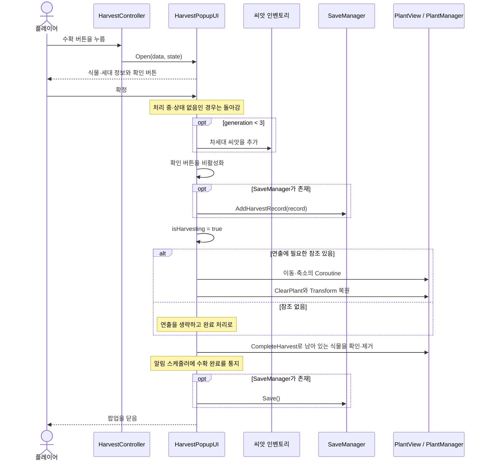
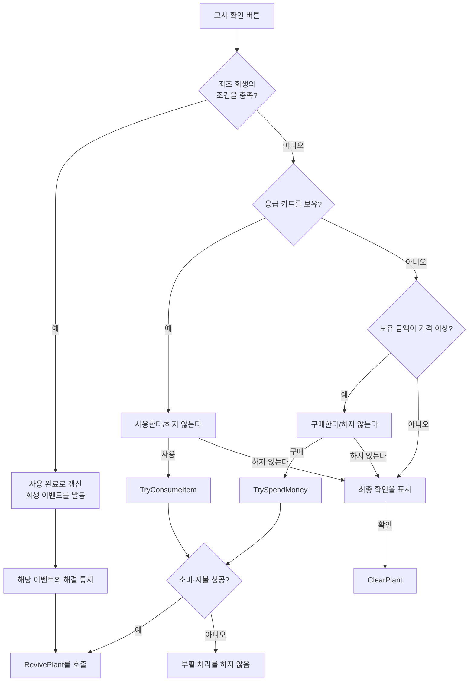
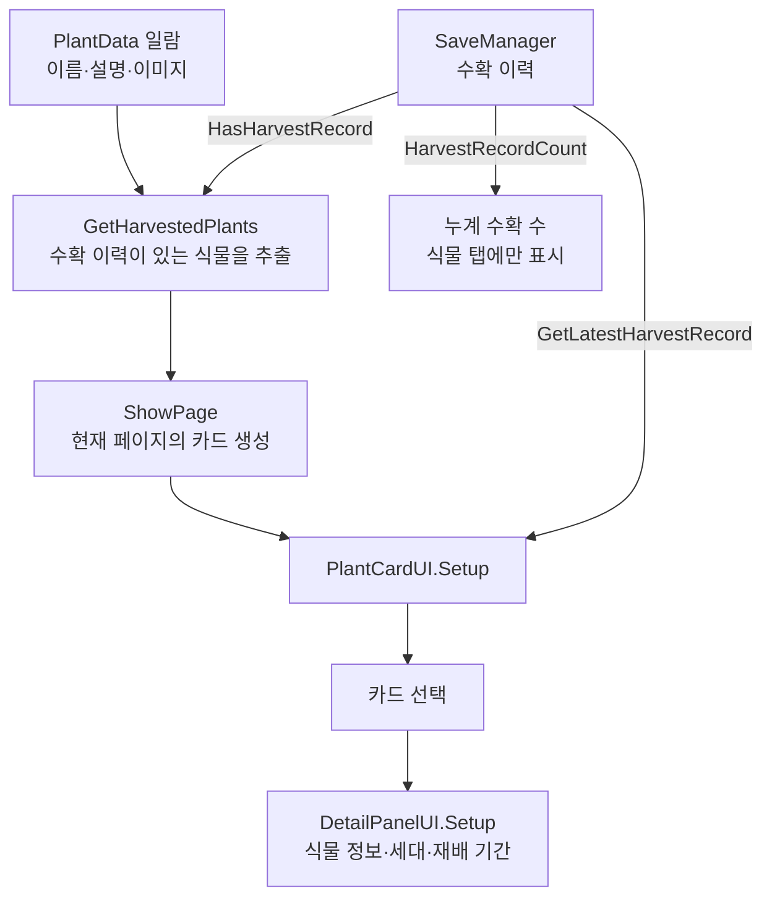
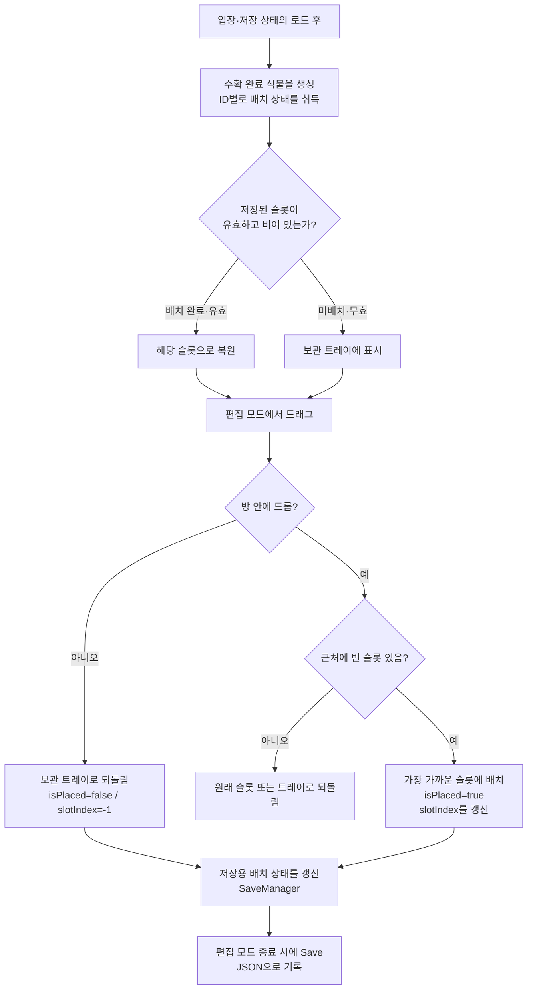
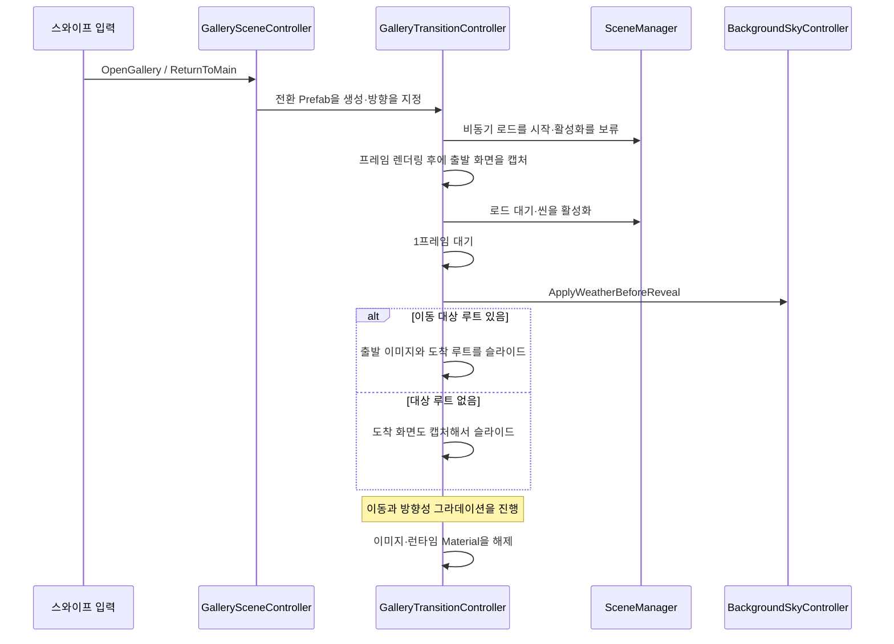
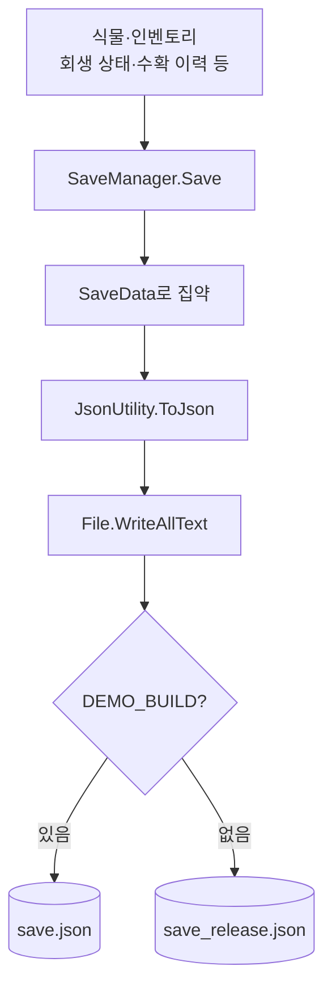
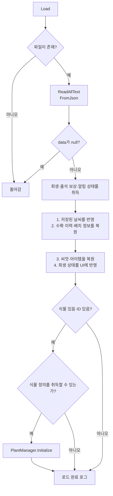

[日本語](Implementation_ja.md) | [한국어](Implementation_ko.md)

# 窓辺の庭 | 담당 기능 구현 해설

[README로 돌아가기](../README.ko.md)

수확·고사/부활·식물 도감·갤러리·저장 처리에 대해, 게시된 코드에서 읽어낼 수 있는 처리 순서와 조건을 정리한 자료입니다. 게임 전체의 사양서가 아니라, 담당 기능을 이해하기 위한 기술 자료로 구성했습니다.

| 대상 | 기준 |
| --- | --- |
| 대상 코드 | 담당 기능과 관련된 18개 파일(C# 스크립트 17개·셰이더 1개) |
| 상정 독자 | 채용 담당자·Unity 엔지니어 |
| 기재 방침 | 구현이 완료된 동작과 개선 후보를 구분. Inspector의 설정이 불명확한 값은 코드상의 초기값으로 기재 |

**목차:** [수확](#harvest) / [고사·부활](#revive) / [도감](#encyclopedia) / [갤러리](#gallery) / [저장·복원](#save-load) / [개선 사례](#improvements) / [담당 범위](#contributions)

<a id="harvest"></a>
## 1. 수확: 확정 조작부터 저장까지

**목적:** 육성 결과를 다음 씨앗과 수확 이력으로 연결하고, 식물이 도감으로 이동하는 연출로 완료를 전달합니다.

코드: [HarvestController.cs](../Scripts/Harvest/HarvestController.cs) / [HarvestPopupUI.cs](../Scripts/Harvest/HarvestPopupUI.cs)

### 처리 시퀀스



### 조건과 책무

| 항목 | 게시 코드의 동작 | 대응 메서드 |
| --- | --- | --- |
| 버튼 표시 | 식물 상태가 있고, `harvestReady` 가 참이며, 수확 팝업이 닫혀 있음 | `UpdateHarvestButton()` |
| 확정 조작의 가드 | 처리 중이거나 상태가 없으면 돌아감. 확인 버튼도 비활성화함 | `OnConfirm()` |
| 차세대 씨앗 | 세대가 3 미만인 경우에만 `generation + 1` 의 씨앗을 추가 | `OnConfirm()` |
| 수확 이력 | 식물 ID, 세대, 심은 시각·수확 시각을 기록 | `AddHarvestRecord()` |
| 연출 | 보간 계수 `t * t * (3 - 2 * t)` 로 이동·축소 | `PlayHarvestAnimation()` |
| 연출 생략 | PlantView, 목적지, 카메라 중 하나라도 없으면 완료 처리로 | 위와 동일 |

**좌표 변환의 요점:** 도감 버튼의 위치를 스크린 좌표로 변환하고, 식물의 깊이를 사용해 월드 좌표로 되돌립니다. 서로 다른 렌더링 공간의 오브젝트를 화면상에서 같은 목적지로 향하게 하기 위해서입니다.

> 씨앗의 지급과 수확 기록의 추가는 연출 전, 파일 저장은 연출 후입니다. 이 일련의 처리에 트랜잭션이나 롤백은 없습니다. 중간 예외·연출 중단까지 포함해 완전한 1회 실행을 보장하는 구현은 아닙니다.

<a id="revive"></a>
## 2. 고사·부활: 상황에 따른 선택지

**목적:** 고사한 식물에 대해 최초 회생·응급 키트·구매라는 선택지를 상태에 따라 제시합니다.

코드: [DeathController.cs](../Scripts/DeathRevive/DeathController.cs)

### 확인 버튼 입력 후의 분기



| 처리 | 구현 내용 |
| --- | --- |
| 최초 회생의 조건 | 미사용이며, 회생 이벤트와 `EventManager` 가 존재할 것 |
| 이벤트 구독 | `Start()` 에서 고사·이벤트 해결 통지를 구독하고, `OnDestroy()` 에서 해제 |
| 경고 표시 | 활력 30 이하에서 경고 배지. 생존 중에는 붉은 기, 고사 상태에서는 어두운 색을 적용 |
| 조작 제한 | 식물 상태가 존재하고 고사한 경우에 클릭 차단 오브젝트를 활성화 |
| 키트 가격 | 아이템 정의의 가격을 우선. 없으면 초기값 100의 폴백. 음수는 0으로 보정 |
| 부활 시의 값 | `reviveVitality` 를 전달. 코드상의 초기값은 40이며 Inspector에서 변경 가능 |
| 최초 회생의 저장 | `GetFirstReviveUsedForSave()` / `SetFirstReviveUsedFromSave()` 로 주고받음 |

**구현상의 주의:** 최초 사용 플래그는 이벤트 발동 전에 갱신합니다. 이 분기 내에서는 직접 저장을 호출하지 않습니다. 또한 `HandleDeath()` 는 `statusPopup` 이 없으면 돌아가기 때문에, UI 참조의 설정이 필요합니다. 이벤트 해결 시에는 이벤트의 일치를 판정하며, 선택 번호별 분기는 하지 않습니다.

<a id="encyclopedia"></a>
## 3. 식물 도감: 정의 데이터와 수확 이력을 합성

**목적:** 수확이 완료된 식물을 일람화하고, 최근의 육성 결과를 상세 화면에서 돌아볼 수 있게 합니다.

코드: [CollectionUI.cs](../Scripts/Encyclopedia/CollectionUI.cs) / [PlantCardUI.cs](../Scripts/Encyclopedia/PlantCardUI.cs) / [DetailPanelUI.cs](../Scripts/Encyclopedia/DetailPanelUI.cs)



### 표시 규칙

| 항목 | 규칙 |
| --- | --- |
| 식물 정의의 취득 출처 | `GameManager.availablePlants` 가 있으면 우선하고, 없으면 Inspector의 `plantDataList` |
| 표시 대상 | 유효한 식물 ID를 가지고, 수확 이력이 존재하는 식물 정의 |
| 페이지 생성 | 기존 카드를 폐기하고 현재 페이지의 카드를 생성. `cardsPerPage` 의 초기값은 9 |
| 페이지 경계 | 0건이어도 페이지 수를 1 이상으로 하고, 앞뒤 버튼을 범위에 따라 비활성화 |
| 상세에 사용하는 이력 | 리스트를 끝에서부터 검색한, 식물 ID가 일치하는 최신의 추가 기록 |
| 재배 기간 | 저장된 UTC ticks를 로컬 시각으로 변환해 표시. 시각이 미설정이면 `-` |
| 누계 수확 수 | 식물의 종류 수가 아니라 수확 기록의 총 건수 |

**설계상의 분리:** 이름이나 이미지는 식물 정의, 세대나 수확 시각은 플레이 이력에 갖게 하고 있습니다. 카드와 상세 화면은 양쪽을 조합해 표시하는 역할입니다. 현재의 페이지 갱신은 재생성 방식이며, 오브젝트 풀은 도입하지 않았습니다.

<a id="gallery"></a>
## 4. 갤러리: 수확한 식물을 전시

**목적:** 수확이 완료된 식물을 보관 트레이에서 꺼내 선반에 배치하고, 재입장 후에도 전시한 상태를 유지합니다.

### 코드의 역할

| 코드 | 책무 |
| --- | --- |
| [GalleryPlacementController.cs](../Scripts/Gallery/GalleryPlacementController.cs) | 수확 완료 식물의 생성, 빈 슬롯 탐색, 배치·복원, 저장용 상태의 갱신 |
| [GalleryPlantDragItem.cs](../Scripts/Gallery/GalleryPlantDragItem.cs) | 드래그 방향의 판정, 스크롤로의 전달, 표시 배율·기준 위치의 전환 |
| [GalleryPlacementSlot.cs](../Scripts/Gallery/GalleryPlacementSlot.cs) | 슬롯 번호와 배치 가이드의 표시 |
| [GalleryEditModeController.cs](../Scripts/Gallery/GalleryEditModeController.cs) | 편집 모드, 보관 트레이, 씬 스와이프의 전환, 편집 종료 시의 저장 |
| [GallerySwipeController.cs](../Scripts/Gallery/GallerySwipeController.cs) | Input System에 의한 가로 스와이프 판정과 씬 이동 요청 |
| [UIInputBlocker.cs](../Scripts/Gallery/UIInputBlocker.cs) | 표시 중인 UI에 따라 씬 스와이프를 억제 |
| [GallerySceneController.cs](../Scripts/Gallery/GallerySceneController.cs) | 이동 대상·방향의 지정, 전환의 다중 시작 방지 |
| [GalleryTransitionController.cs](../Scripts/Gallery/GalleryTransitionController.cs) | 비동기 씬 로드, 화면 캡처, 슬라이드와 페이드의 진행 |
| [GalleryTransitionTarget.cs](../Scripts/Gallery/GalleryTransitionTarget.cs) | 전환 연출에서 이동하는 화면 루트의 지정 |
| [DirectionalUIFade.shader](../Shaders/DirectionalUIFade.shader) | 방향과 진행도에 따른 검은 그라데이션의 알파 계산 |

### 현재의 배치 플로우



생성 대상은 수확 횟수만큼이 아니라 `HasHarvestRecord(plantId)` 를 충족하는 식물 정의입니다. 표시 이미지에는 마지막 유효한 성장 단계의 스프라이트를 사용합니다. `Start()` 에서는 1프레임 기다린 뒤 슬롯을 구성하고 식물을 생성합니다.

슬롯 번호는 `placementSlotsRoot` 의 자식 순서에서 할당합니다. 드롭 위치를 방의 로컬 좌표로 변환하고, `slotSnapDistance` 내에서 가장 가까운 빈 슬롯을 선택합니다. 배치 대상의 자식으로 바꿔 붙이고 중앙 앵커·`anchoredPosition = Vector2.zero` 에 맞추기 때문에, 현재의 방식은 자유 좌표 배치가 아닙니다.

> `SetGalleryPlantState()` 는 메모리상의 상태 갱신입니다. 드롭할 때마다 파일에 쓰는 것이 아니라, 편집 모드 종료 시 등의 `Save()` 에서 영속화합니다.

### 자유 배치에서 고정 슬롯으로의 변경

| 단계·근거 | 본인이 구현한 내용 |
| --- | --- |
| 7월 23일 `6267616` / `f8336c7` | 배치 저장 모델과 취득·갱신 API, 스와이프·배치·드래그의 골격을 추가 |
| 7월 25일 `0ba0fdd` | 방 안의 드롭 위치를 `Mathf.InverseLerp` 로 0~1로 정규화하고 `normalizedX/Y` 를 저장. 재입장 시에는 앵커 좌표로 되돌리는 자유 배치를 구현 |
| 8월 5일 `8976c5f` | 고정 슬롯으로 변경. `slotIndex` 를 추가하고, 빈자리 판정·스냅·배치 가이드·무효 드롭 시의 복귀·저장 복원을 구현 |
| 8월 6일 `914fc9a` | 트레이의 가로 스크롤과 위쪽 방향의 꺼내기를 분리. 씬 측에 Viewport의 마스크와 Content Size Fitter를 설정 |
| 8월 28일 `8f8172c` | 성장 단계별 정규화 배율을 갤러리에 적용하고, 트레이와 배치 상태의 배율을 분리 |
| 9월 5일 `311811e` / 9월 6일 `f757bd1` | Native Size와 화분의 하단 기준으로 표시를 보정. 갤러리 전용 배율을 식물 정의에 추가 |

**사양 변경 전의 자유 배치와, 변경 후의 슬롯 배치 양쪽 모두를 본인이 담당하고 있습니다.** 커밋에는 방식 변경이 명기되어 있지만, 그 판단에 이른 기획상의 이유까지는 추측해서 기재하지 않습니다.

구 필드인 `normalizedX/Y`, `listOrder`, `sortingOrder` 는 저장 모델에 남아 있습니다. 다만 현재의 위치 복원은 `slotIndex` 를 사용하며, 저장 순서에 의한 카드의 정렬이나 앞뒤 관계의 복원은 하지 않습니다. 구 좌표를 슬롯으로 자동 변환하는 이행 처리도 없고, 무효한 슬롯 정보는 미배치로 되돌립니다. 슬롯의 자식 순서를 바꾸면 번호의 의미도 바뀌는 점이 현재 저장 방식의 제약입니다.

### 터치 조작과 외형의 분리

| 조작·상태 | 게시 코드의 동작 |
| --- | --- |
| 트레이 위에서 좌우로 드래그 | Content 폭이 Viewport 폭을 넘는 경우에만 ScrollRect로 전송. 카드 장수를 고정값으로 판정하지 않음 |
| 트레이 위에서 위쪽으로 드래그 | 식물 배치 모드로 전환하고, 스크롤의 관성을 정지 |
| 트레이 위에서 아래쪽으로 드래그 | 식물의 꺼내기를 시작하지 않음 |
| 배치 완료된 식물을 드래그 | 편집 중에는 방향과 관계없이 식물을 이동 |
| 편집 중 | 씬 전환용 스와이프를 무효화하고, 빈 슬롯의 가이드를 표시 |
| 트레이 내의 이미지 | 중앙 피벗으로 카드 안에 배치 |
| 선반에 놓은 이미지 | 하단 중앙 피벗과 Y 오프셋으로 화분의 접지 위치를 조정 |

표시 배율은 `galleryBaseScale × 식물별 배율 × 배치 상태별 배율` 입니다. 식물별 배율에는 `PlantData.galleryVisualScaleOverride` 가 양수이면 그것을 사용하고, 미지정이면 `GetGrowthStageVisualScale()` 을 사용합니다. 원래의 정규화 배율 기반은 팀 멤버가 구현했고, 본인이 갤러리로의 적용과 전용 보정을 담당했습니다.

### 씬 전환과 담당의 경계



본인은 `723c953` 에서 전환 제어를 신규 작성하고, `1531e50`·`5f175f8` 에서 연출을 개수했습니다. `5f175f8` 에서는 방향성 페이드용 셰이더도 추가하고, 화면 캡처와 표시 타이밍을 조정했습니다.

게시된 버전에는 그 이후의 팀 개선도 포함됩니다. `adeb875` 에서는 캡처 캐시의 이용, 출발·도착 각각의 페이드, 이동 타이밍과 셰이더가 확장되었습니다. `5b5191a` 에서는 캐시 경로를 삭제하고, 현재의 출발 화면을 다시 촬영해, 도착 화면의 공개 전에 날씨를 반영하는 흐름으로 변경되었습니다. **위 그림은 본인의 초기 버전만이 아니라, 팀 개선 후의 게시 버전 플로우입니다.**

<a id="save-load"></a>
## 5. 저장·복원: 여러 기능의 상태를 집약

코드: [SaveManager.cs](../Scripts/SaveLoad/SaveManager.cs) / [SaveData.cs](../Scripts/SaveLoad/SaveData.cs)

### 저장 위치의 선택과 쓰기



위 그림의 분기는 저장 위치의 대응을 나타냅니다. 구현에서는 빌드 시의 `#if DEMO_BUILD` 에 의해 파일명이 확정되며, 실행 시에 파일명을 다시 선택하는 것은 아닙니다.

### 로드 순서



이것은 **게시 버전의 실제 순서**입니다. 읽기·JSON 파싱 시의 예외를 포착하는 처리는 없으며, 예외 발생 시에는 이 정상계 플로우를 완료하지 않습니다. 식물 정의를 취득할 수 없는 경우에도 게시 버전에서는 에러로 취급하지 않고 완료 로그로 진행합니다.

### 저장 데이터의 책무

| 데이터 | 주요 필드 | 용도 |
| --- | --- | --- |
| 현재의 식물 | `hasPlant`, `plantId`, `PlantState` | 육성 중인 상태를 복원 |
| 소지품 | `seeds`, `items` | 씨앗·아이템의 보유 상태 |
| 회생 상태 | `firstReviveUsed` | 최초 회생의 사용 여부 |
| 수확 기록 | `harvestRecords` | 도감의 개방·건수·상세 표시 |
| 배치 정보 | `galleryPlants` | 식물 ID·배치 상태·`slotIndex`. 표시와 복원은 [갤러리](#gallery) 참조 |
| 시각 | `lastSavedUtcTicks` | 저장 시점을 기록 |
| 그 외의 연계 | `weatherState`, 출석 보상 필드, `notificationState` | 팀의 관련 기능의 상태 저장 |

`HarvestRecordData` 는 식물 ID·세대·심은 시각·수확 시각을 보유합니다. `traitIds` 도 남아 있지만, 현재 게시하고 있는 수확 확정 처리에서는 특성의 선택·설정을 하지 않습니다.

### 현재의 제약과 개선 방향

| 게시 버전의 동작 | 리스크·개선 방향 |
| --- | --- |
| 원본에 직접 쓰기 | 쓰기 중단에 대한 대비로서, 검증이 완료된 임시 파일에 의한 치환·백업이 필요 |
| 로드 성공 상태를 관리하지 않음 | 로드 실패 후에 초기 상태를 자동 저장해 버리는 경로를 방지할 필요 |
| 날씨 통지가 다른 상태 복원보다 먼저 | 이벤트 구독 측이 부분 복원 중인 상태에 접근할 가능성을 고려할 필요 |
| 파일명만 데모/릴리스 분리 | PlayerPrefs, OS 권한, 위젯 공유 영역은 이 분리의 대상 외 |

> `SaveFileStore`·`SaveSafetyChecks` 에 의한 안정화는 별도로 작업 중이며, 게시 버전에는 포함하지 않습니다. 특정 사용자의 데이터 소실에 대해, 이 리스크들이 실제 발생 원인이었다고 단정하는 것은 아닙니다.

<a id="improvements"></a>
## 6. 개선 사례와 검증 범위

### 사례 A: 두 번째 수확에서 확인 버튼을 누를 수 없음

| 관점 | 내용 |
| --- | --- |
| 증상 | 수확 후, 다음 수확 팝업에서 확인 버튼이 비활성 상태로 남음 |
| 원인 | 확정 시에 비활성화한 상태를, 재표시 시에 되돌리지 않았음 |
| 변경 | `Open()` 에서 `confirmButton.interactable = true` 를 설정 |
| 착안점 | 닫는 처리만이 아니라, 재표시 시에 UI 상태를 초기화함 |
| 근거 | 원본 프로젝트의 커밋 `cff9aad` 와 게시 코드. 이번 자료 작성에서는 실기 재테스트는 미실시 |

**변경 부분의 발췌(전 → 후):**

```csharp
// Before: Open()で状態を受け取るだけ
currentState = state;

// After: 再表示時にボタンも操作可能へ戻す
currentState = state;
confirmButton.interactable = true;
```

당시의 커밋에는 특성 선택값의 리셋도 포함됩니다. 위는 현재의 게시 버전에도 남아 있는 확인 버튼의 변경만을 발췌한 것입니다.

### 사례 B: 데모와 릴리스의 저장 위치를 분리

| 관점 | 변경 전 | 변경 후 |
| --- | --- | --- |
| 저장 위치 | 동일한 `save.json` | `DEMO_BUILD` 이면 `save.json`, 그 외에는 `save_release.json` |
| 테스트 데이터 | 동일 저장 영역에서는 섞일 수 있음 | 파일명에 의해 진행 데이터를 분리 |
| 기존 데이터 | 공통 파일을 사용 | 자동 이행·삭제는 하지 않음 |

```csharp
#if DEMO_BUILD
private const string SaveFileName = "save.json";
#else
private const string SaveFileName = "save_release.json";
#endif
```

근거: 원본 프로젝트의 커밋 `a8bde20`. 초기 배포 데이터의 변경도 포함되는 커밋이지만, 이 자료에서는 저장 측의 변경을 대상으로 합니다.

### 이 자료에서 확인한 것

| 항목 | 확인 상황 |
| --- | --- |
| 처리 순서·조건 | 게시된 18개 파일(C# 17개·셰이더 1개)을 읽고 플로우와 대조 |
| 본인·팀의 담당 구분 | 원본 프로젝트의 커밋 이력과 diff를 확인 |
| 코드의 동일성 | 동일 커밋에서 발췌. `DeathController.cs` 는 말미 개행만 추가 |
| 단독 컴파일·실기 동작 | 이 발췌 리포지토리에서는 미실시. 공통 코드와 씬을 동봉하지 않았기 때문에 단독 실행 불가 |
| 저장 안정화의 검증 결과 | 게시 버전의 결과에는 포함하지 않음 |

<a id="contributions"></a>
## 7. 초기 구현과 기능 확장의 담당 범위

**본 자료에서 다루는 수확·고사/부활·식물 도감·갤러리·저장/복원은, 본인이 주담당으로서 기능 설계·초기 구현을 수행하고 그 이후에도 확장해 온 기능입니다.** 기존 기능의 일부 수정만을 담당한 것은 아닙니다. 팀 멤버에 의한 후속 기능 연계·개선은 아래에서 구분해 기재합니다.

### 본인에 의한 초기 구현의 근거

원본 프로젝트의 파일 추가 diff와, 이동 전 경로를 포함한 변경 이력을 확인하고 있습니다. 담당자의 커밋 이름은 `yoogihyun` / `62String` 입니다.

| 파일 | 초기 구현의 커밋 | 그 시점에 구현한 내용 |
| --- | --- | --- |
| `CollectionUI.cs` | `4043623` | 페이지 표시·앞뒤 이동·버튼 연결. 초기 경로는 `Assets/Scripts/UI/CollectionUI.cs` 이며, 이후 배치 위치를 변경 |
| `SaveManager.cs` | `817aa89` | 신규 작성 시점부터 `Save()`·`Load()`·`ResetSave()` 를 구현. 식물·씨앗·아이템의 JSON 저장과 복원 |
| `SaveData.cs` | `817aa89` | 식물 상태, 씨앗, 아이템, 저장 시각을 묶는 직렬화용 모델을 신규 작성 |
| `HarvestPopupUI.cs` | `a363d54` | 식물 정보를 표시하는 수확 팝업, 당시의 특성 선택 처리를 신규 구현 |
| `DeathController.cs` | `03c5656` | 고사 이벤트와 표시 제어를 연결하는 컨트롤러를 신규 구현 |
| `GalleryPlacementController.cs`, `GalleryPlantDragItem.cs`, `GallerySwipeController.cs` | `f8336c7` | 배치·드래그·스와이프의 골격을 신규 작성. `0ba0fdd` 에서 Gallery 폴더로 이동하고, 자유 배치·저장·씬 연계를 구현 |
| `GalleryEditModeController.cs`, `GallerySceneController.cs`, `UIInputBlocker.cs` | `0ba0fdd` | 편집 모드, 씬 이동, UI 상태에 따른 스와이프 억제를 신규 구현 |
| `GalleryPlacementSlot.cs` | `8976c5f` | 고정 슬롯의 번호와 가이드를 신규 구현 |
| `GalleryTransitionController.cs`, `GalleryTransitionTarget.cs` | `723c953` | 씬 전환 연출의 제어와 이동 대상 루트를 신규 구현 |
| `DirectionalUIFade.shader` | `5f175f8` | 방향성 페이드용 셰이더를 신규 구현 |

### 본인에 의한 주요 기능 확장

| 분류 | 확장·개선한 내용 | 주요 커밋 |
| --- | --- | --- |
| 수확 | 차세대 씨앗 지급부터 빈 화분으로의 전환, 수확 기록, 도감으로의 이동 연출 | `70d4428` / `bf32fff` / `86f500e` |
| 고사·부활 | 응급 키트·구매에 의한 부활 분기, 최초 회생 이벤트와 저장 연계 | `b35691e` / `5a2a634` |
| 식물 도감 | 탭·페이지 경계, 동적 카드 생성, 상세 표시, 수확 이력에 의한 추출·건수 표시 | `4cf791b` / `0456e49` / `c0bc927` / `7554944` / `4727b49` |
| 갤러리 배치 | 자유 배치에서 고정 슬롯으로 변경, 드래그와 스크롤의 분리, 표시 배율·하단 위치의 조정 | `0ba0fdd` / `8976c5f` / `914fc9a` / `8f8172c` / `311811e` / `f757bd1` |
| 갤러리 전환 | 슬라이드·방향성 페이드, 캡처와 표시 타이밍의 조정 | `723c953` / `1531e50` / `5f175f8` |
| 저장·복원 | 회생·수확·배치 정보의 저장, 실행 중 데이터의 초기화, 데모/릴리스 분리 | `5a2a634` / `bf32fff` / `6267616` / `0fe7dca` / `a8bde20` |

### 팀 멤버에 의한 후속 추가·개선

본인의 초기 구현·확장을 기반으로, 팀 개발 과정에서 다음의 변경이 더해졌습니다. 게시 버전에서는 기능 간의 연결을 유지하기 위해 그 변경도 남기고 있습니다.

| 파일 | 후속 추가·개선 |
| --- | --- |
| `HarvestPopupUI.cs` | 세대 처리의 일부, 연출 중인 식물 위치 정렬 제어 |
| `CollectionUI.cs` | 씨앗 일람의 연결, 도구 탭, 팝업 연출, 탭 표시 조정 |
| `SaveManager.cs` | 출석 보상·날씨의 저장 연계, 인벤토리 취득·씬 간 유지 처리의 일부 |
| `SaveData.cs` | 출석 보상·날씨의 저장 필드 |
| `GallerySceneController.cs`, `GalleryTransitionController.cs` | `adeb875` 의 캐시·페이드·이동 타이밍 확장, `5b5191a` 의 캐시 삭제와 날씨 반영 후의 표시 처리 |
| `DirectionalUIFade.shader` | `adeb875` 의 이펙트 모드·그라데이션 계산의 확장 |
| `PlantData`(의존 코드·미게시) | `34a3f26` 의 성장 단계별 정규화 배율. 본인은 이후에 갤러리 적용과 전용 배율을 추가 |

위는 담당 기능의 구현 이력을 나타내는 것이며, 의존하는 게임 기반이나 소재를 포함한 작품 전체의 단독 제작을 의미하는 것은 아닙니다.

### 미게시된 의존 요소

| 요소 | 게시 코드와의 접점 |
| --- | --- |
| `GameManager`, `PlantManager` | 정의 데이터 취득, 식물 상태, 고사 통지, 부활·제거 |
| 씨앗·아이템의 인벤토리 | 씨앗의 지급, 보유 판정, 소비·지불, 저장 리스트 |
| `PlantData`, `PlantState`, `PlantView` | 식물의 정의·상태·렌더링 |
| `BackgroundSkyController` | 씬 전환에서 도착 화면을 표시하기 전의 날씨 반영 |
| 이벤트·알림 시스템 | 최초 회생 이벤트, 수확 후의 알림 스케줄 연계 |
| 씬·Prefab·공통 UI | Inspector 참조, 화면 배치, 팝업의 표시 제어 |

**게시 방침:** 서드파티 제작 에셋, 제품의 저장 데이터, 서명·인증 정보는 수록하지 않았습니다.

### 소스의 기준 정보

게시한 18개 파일(C# 스크립트 17개·셰이더 1개)은 원본 프로젝트의 커밋 `a8bde20` 을 기준으로 발췌했습니다. 갤러리 관련의 추가 10개 파일은 동일 커밋과 바이트 단위로 동일합니다.
